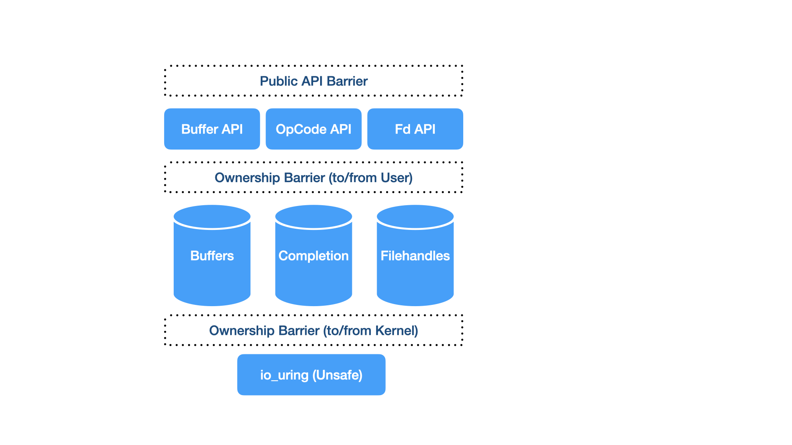

# Introduction

yaws io_uring abstracts the underlying low level Linux io_uring library.

We aim to provide safer semantics towards managing all the moving parts given these have complex lifetimes and ownership, typically shared between the kernel, userspace and the user.

## Bearer

UringBearer (io-uring-bearer) is the carrier holding all of the io_uring associated generated instances of types.

## OpCode

OpCode and OpCode (io-uring-opcode) are the contracts between bearer and individual opcode implementations.

In addition it provides the required extension traits for implementing the individual opcodes.

## Ownership

Owner (io-uring-owner) provides the ownership semantics between kernel, userspace and the user.

## Filehandles

RegisteredFd and FdKind (io-uring-fd) provides the types representing filehandles within io_uring.

## Buffers

UringBuffer (io-uring-buffer) will provide the types representing buffers within io_uring.

**Note**: As of time writing buffers are still within the bearer but this will change.
