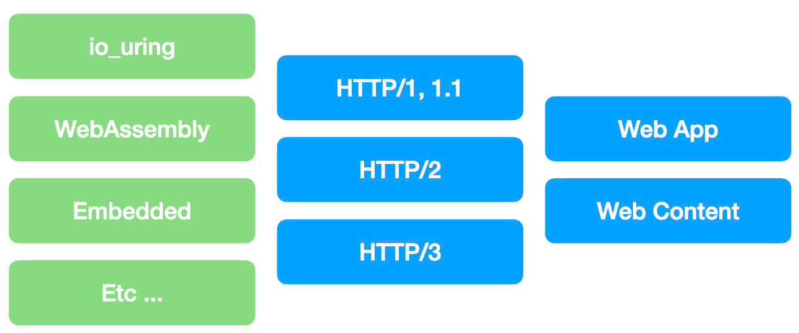

# yaws

yaws is a harmonized environment-neutral open source HTTP server capability.

Traditionally Web Servers are monolithic in nature with the tight coupling of std/environment.

yaws de-couples the construct in a way that HTTP servers are environment-neutral in nature.

